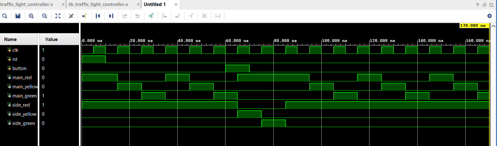
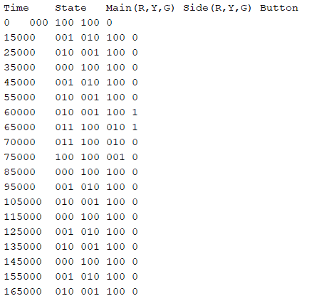

# 🚦 Traffic Light Controller (Verilog | FSM | RTL Design)

## 🧭 Overview
This project implements a **Finite State Machine (FSM)-based Traffic Light Controller** using **Verilog HDL**, designed to manage **North–South (NS)** and **East–West (EW)** traffic flow.  
The controller features **timed sequencing**, **manual override (button-based control)**, and **asynchronous reset functionality**.  
The design was developed, simulated, and verified using **Xilinx Vivado**, showcasing practical skills in **RTL design and verification**.

---

## ⚙️ Features
- FSM-based design for traffic light management  
- Asynchronous reset and manual button-triggered override  
- Integrated timer/counter and output encoder logic  
- **Vivado simulation** for waveform and timing verification  
- Testbench includes clock generation, reset, and button press sequences  
- Output validation via both **waveform** and **console logs**

---

## 🧩 Design Details

| Signal | Description |
|:-------|:-------------|
| `clk` | System clock |
| `rst` | Asynchronous reset |
| `button` | Manual button input for side-road activation |
| `main_red`, `main_yellow`, `main_green` | Main road signal lights |
| `side_red`, `side_yellow`, `side_green` | Side road signal lights |

### FSM States

| State | Description |
|:------|:-------------|
| `S0` | Both Red (All Stop) |
| `S1` | Main Yellow (Transition Phase) |
| `S2` | Main Green (Main Flow) |
| `S3` | Main Red + Side Yellow (Prepare Side Flow) |
| `S4` | Main Red + Side Green (Side Flow Active) |

---

## 🧠 Verilog Implementation

### 🔹 Main Module: `traffic_light_controller.v`
Implements the FSM for traffic light sequencing, state transitions, and output control signals.  
State transitions are triggered by **clock**, **reset**, and **button input**.

### 🔹 Testbench: `tb_traffic_light_controller.v`
Generates the **clock**, applies **reset**, and simulates **button presses** to verify system behavior.  
Also logs the current **state** and **signal values** during simulation.

---

## 🧪 Simulation and Verification

### 🖥️ Vivado Waveform Output
Behavioral simulation in Vivado validates the timing and sequencing of all signals.  
The waveform shows correct transitions between traffic states and response to button input.

  

---

### 🧾 Console Output Log
The console output confirms correct state transitions, light sequencing, and response to button activation.

  

---

## 👨‍💻 Author
**Vishwas Jasuja**  
B.Tech Microelectronics and VLSI, IIT Mandi

